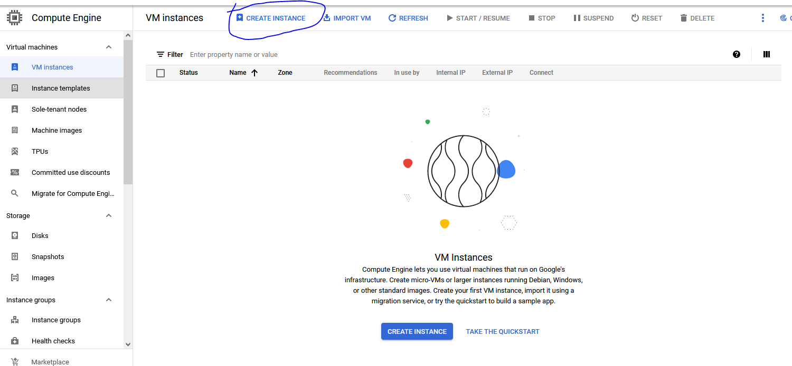
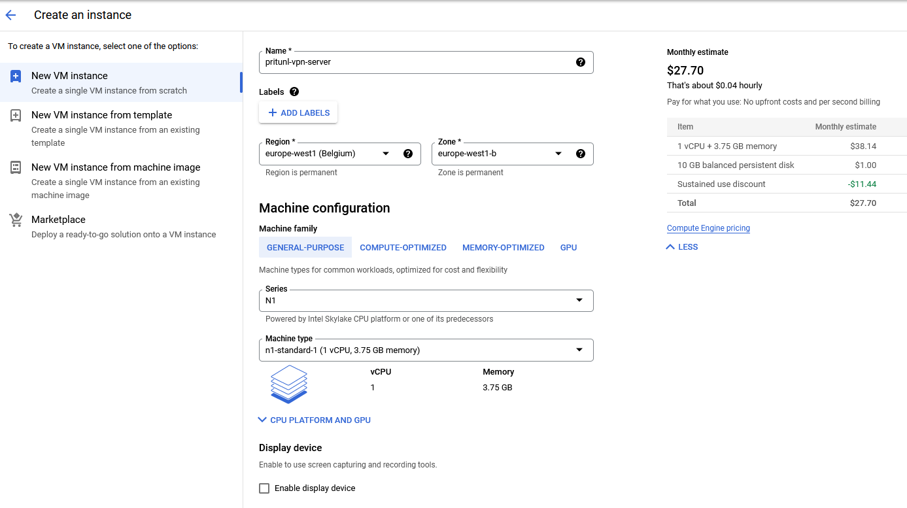
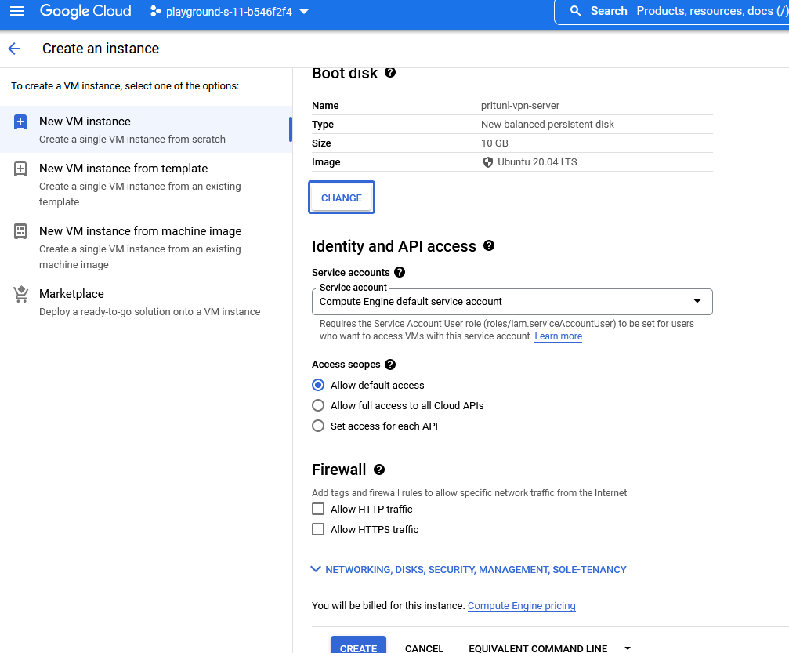
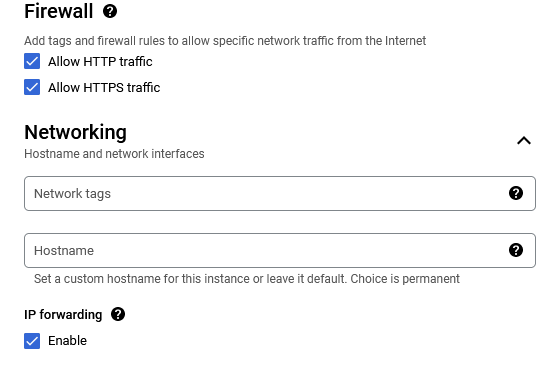

# Create a GCE virtual machine
First, you need login to your [google cloud account](https://console.cloud.google.com) and select the project in which you want to create your vpn server, then in the right side bar menu search google compute engine and select [VM instances](https://console.cloud.google.com/compute/instances).
Click on the button [CREATE INSTANCE](https://console.cloud.google.com/compute/instancesAdd) at the top

We will create an Ubuntu 20.04 LTS vm,
we fill the fields as follow
Name: pritunl-vpn-server
region: europe-west1
Machine family
serie: N1

Boot disk
image: Ubuntu 20.04 LTS
Firewall
coche the two cases (ALLOW HTTP traffic and ALLOW HTTPS traffic)

Expand the Networking section and coche enable under IP forwarding

And leave all others fields with default value, then click create.
Alright, we have our virtual machine on GCP, let's go and [install pritunl](https://github.com/Donutson/VPN-SERVER-PRITUNL/blob/main/02-install-pritunl.md) on it.
