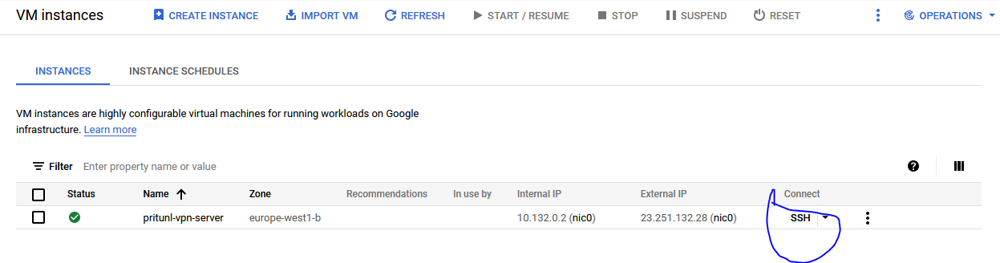
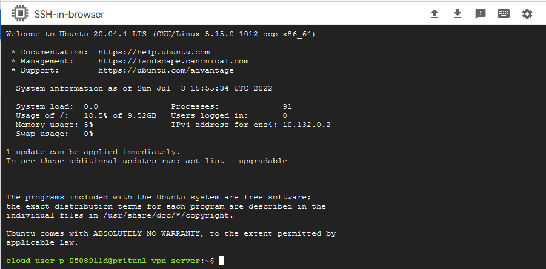

# Install Pritunl
At the left of your new create vm, you can see a bold SSH text, click on it to connect to your instance via ssh protocol


Then execute the following commands, they are only valid for Ubuntu 20.04 LTS, for others operating system you can see [here](https://docs.pritunl.com/docs/installation)
```shell
sudo tee /etc/apt/sources.list.d/pritunl.list << EOF
deb http://repo.pritunl.com/stable/apt focal main
EOF


# Import signing key from keyserver
sudo apt-key adv --keyserver hkp://keyserver.ubuntu.com --recv 7568D9BB55FF9E5287D586017AE645C0CF8E292A
# Alternative import from download if keyserver offline
curl https://raw.githubusercontent.com/pritunl/pgp/master/pritunl_repo_pub.asc | sudo apt-key add -


sudo tee /etc/apt/sources.list.d/mongodb-org-5.0.list << EOF
deb https://repo.mongodb.org/apt/ubuntu focal/mongodb-org/5.0 multiverse
EOF


wget -qO - https://www.mongodb.org/static/pgp/server-5.0.asc | sudo apt-key add -


sudo apt update


# WireGuard server support
sudo apt -y install wireguard wireguard-tools

sudo ufw disable


sudo apt -y install pritunl mongodb-org
sudo systemctl enable mongod pritunl
sudo systemctl start mongod pritunl
```

Now, pritunl is well installed, let's go [configure](https://github.com/Donutson/VPN-SERVER-PRITUNL/blob/main/03-configure-pritunl.md) it.
