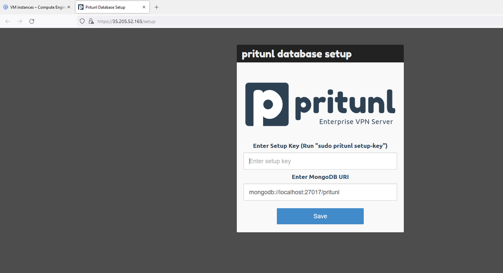

# [Configure Pritunl](https://docs.pritunl.com/docs/configuration-5)

## Increase Open File Limit

Run the commands below to increase the open file limit on the server. This will prevent connections issues on servers with high load. This should also be done on the MongoDB server. Use the command ```sudo lsof -p `pgrep pritunl-web` | wc -l``` to check the file count for the Pritunl web server.

```shell
sudo sh -c 'echo "* hard nofile 64000" >> /etc/security/limits.conf'
sudo sh -c 'echo "* soft nofile 64000" >> /etc/security/limits.conf'
sudo sh -c 'echo "root hard nofile 64000" >> /etc/security/limits.conf'
sudo sh -c 'echo "root soft nofile 64000" >> /etc/security/limits.conf'
```

## Database Setup

When Pritunl starts for the first time a database setup prompt will be shown on the web server running on port 443.
So, let's access our server ip address in a web browser, to get the server ip address just at the left of the bold SSH text.


Now, opens it on a web browser, we get the following setup page


The database setup will prompt for a setup key and MongoDB URI. 
To get the setup key ssh on to the server and run the command ```sudo pritunl setup-key``` this will return the setup key. <br>


By default the MongoDB URI will be filled with the URI for the localhost MongoDB server. 
This should be left as it is when the MongoDB server is running on the same server as the Pritunl instance (our case). 
For Enterprise clusters refer to the MongoDB documentation for Connection String URI Format. 
Alternatively this can be set directly in the /etc/pritunl.conf file or using the cli command.
Some MongoDB servers authenticate on the admin database and require the option authSource=admin to be included in the URI.

## Initial Setup

After the MongoDB database uri has been configured the web console will display the login dialog (if login dialog don't show up, refresh the page or close and re-enter the ip address).<br>


The default username is pritunl, run sudo pritunl default-password to get the default password.


After signing in the initial setup dialog will be shown. 
This will allow changing the username and password. 
The Pritunl servers public address will be automatically detected and should not need to be changed.


To get connected to a vpn server on Pritunl an organization, user and server must be created.

## Organisation and User
To create an organization click Add Organization from the Organization page in the web console. 
Then click Add User an email address and user pin can optionally be included.

<br>
<br>
<br>

## Server
Once the organization and user have been created go to the Servers page and click Add Server. 
By default a random udp port and random vpn network will be selected, in our case we will enter the network of our default VPC network on GCP. The network should not conflict with a local network on your client computer and also be large enough for all users that will be attached to the server. 
The dns server will automatically be set to Google's public dns server. 
Once the server is created click Attach Organization to and attach the organization created earlier to the server. 
Then click Start Server to start the vpn server.

<br>
<br>
<br>

Now we have to just create [firewall rules](https://github.com/Donutson/VPN-SERVER-PRITUNL/blob/main/04-firewall-rules.md) on GCP to allow egress and ingress on the defined port of our server for pritunl.
