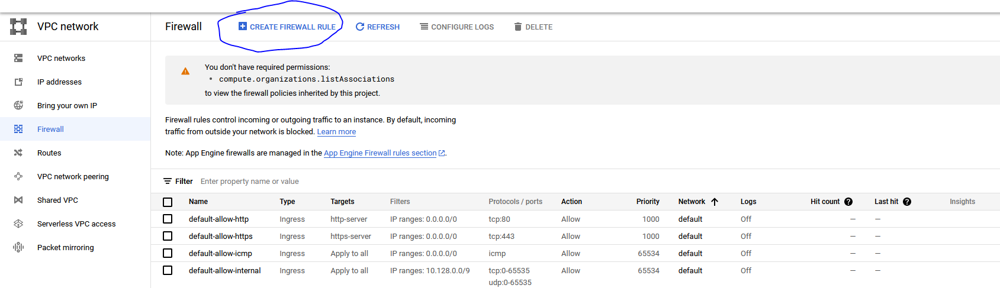
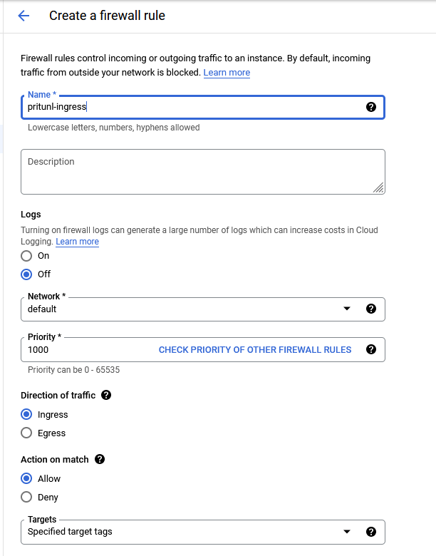
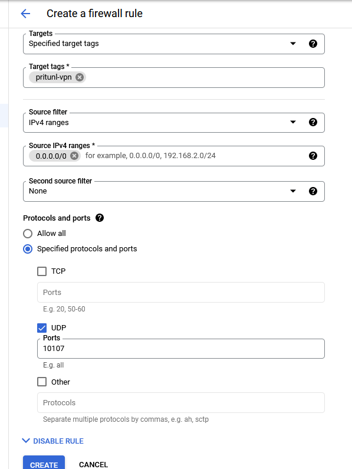

# Create firewall rules

In your gcp console menu bar, search network vpc and then [firewall](https://console.cloud.google.com/networking/firewalls), click on CREATE FIREWALL RULE 
 
We will start with the ingress rule, so use the following parameters 
Name: pritunl-ingress 
Direction of traffic: coche Ingress 
Target tags: pritunl-vpn (we will later tag our pritunl vm with the same tag for him to be affect by our firewall rule) 
Source IPV4 ranges: 0.0.0.0/0 
Specified protocols and ports: coche UDP and enter 10107 as value (or the port you have specified in the configuration of your pritunl instance) 

 
Repeat the same process to create an egress rule (just change Direction of traffic for Egress). Let's see [how to connect to our vpn](05-connect-to-pritunl.md).
