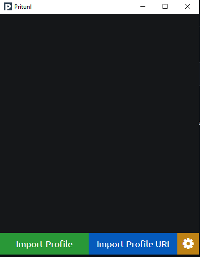

# Connection to pritunl vpn

First you need to install the pritunl client, follow the documentation [here](https://client.pritunl.com/) depending of your operating system
Now go to pritunl vpn web page (open your pritunl server ip on a browser), and next to your created Test user you will see a link symbol, click on it 
 
Copy the last link (Temporary uri link for Pritunl Client, expires after 24 hours) 
 
Now open your pritunl client and click on Import Profile URI and paste in the link and click on import. 
 
The Test user profile will be display, click on the burger menu and then on the connect button, your pin will be ask, enter it and you will be connected. 
 
If you have configure your pritunl vpn to use two factor authenticator, you can use the [Authenticator addons](https://addons.mozilla.org/fr/firefox/addon/auth-helper/) to get your OTP code (i will not talk about this)
Congratulations, you are now connected to your vpn 
 
To disconnect, just click the burger menu then disconnect
